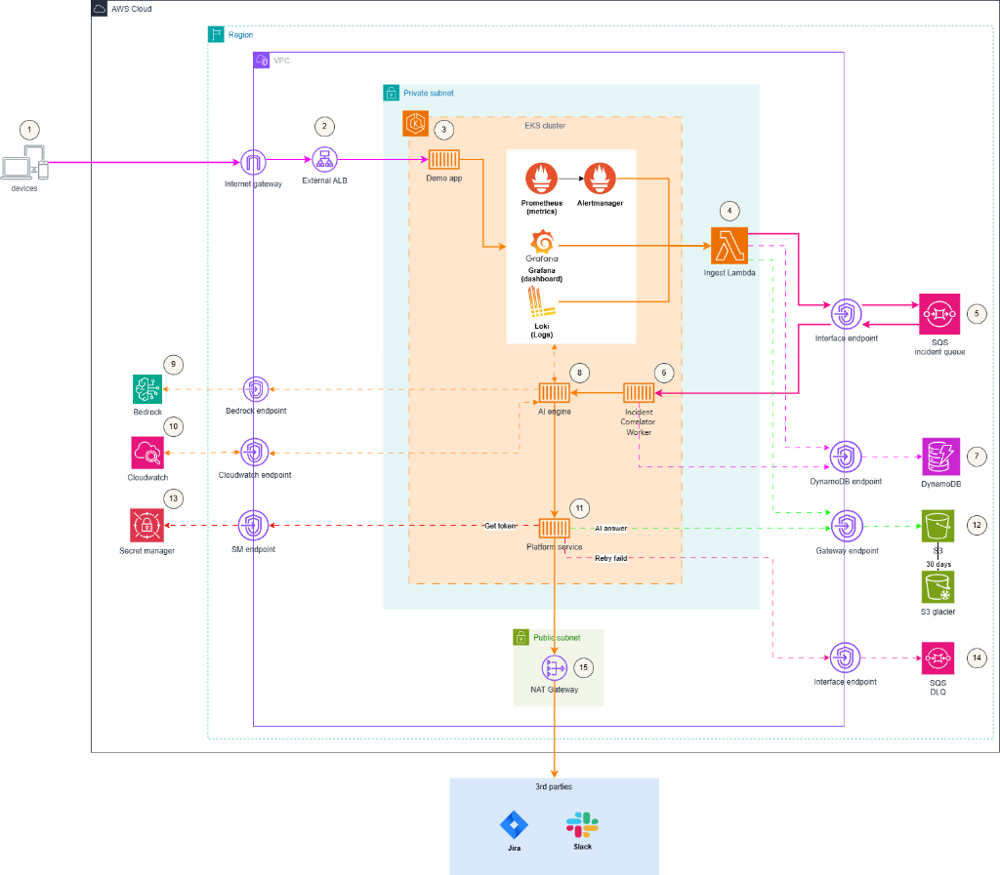

# Thiết kế Hạ tầng - Task Force 1 · CDO 5

## 1. Sơ đồ kiến trúc



## 1.1 Luồng incident chính

```text
PrometheusRule
        │
        ▼
Alertmanager
(Nhóm / Ức chế / Tắt tiếng / Khoảng thời gian lặp lại)
        │
        ▼
Ingest Lambda
(Xác thực + Chuẩn hóa alert webhook)
        │
        ▼
SQS FIFO Raw Alert Queue
(Bộ đệm alert bền vững)
        │
        ▼
CDO Incident Correlator Worker trên EKS
(Lọc trùng + Nhóm các sự kiện alert)
        │
        ▼
AI Engine / RCA
(Truy vấn Prometheus/Loki + Thực hiện RCA)
        │
        ▼
Integration Lambda / Lớp Tích hợp CDO
(Tạo / cập nhật Slack và Jira)
        │
        ▼
Slack / Jira
(Theo dõi và thông báo sự cố cho con người)
```

## 1.2 Trạng thái chia sẻ và kho lưu trữ artifact

DynamoDB và S3 không nằm trên đường đi trực tiếp của luồng dữ liệu chính. Đây là các kho lưu trữ chia sẻ được sử dụng bởi nhiều thành phần trong pipeline xử lý sự cố.

```text
                         ┌──────────────────────────────────────────────┐
                         │ Bảng DynamoDB (Trạng thái & Chống trùng)     │
                         │ 1. incident-state: Trạng thái & Tiến trình   │
                         │ 2. idempotency: Khóa chống trùng lặp (TTL)   │
                         └──────────────────────────────────────────────┘
                                      ▲
                                      │ đọc/ghi
        ┌─────────────────────────────┼─────────────────────────────┐
        │                             │                             │
Ingest Lambda              CDO Correlator Worker          Integration Lambda
ghi khóa idempotency       đọc/ghi trạng thái workflow    đọc/ghi trạng thái Jira/Slack
ghi trạng thái hàng đợi    ghi trạng thái AI              ghi trạng thái tích hợp
ghi con trỏ S3 URI         ghi con trỏ S3 URI             ghi con trỏ S3 URI
```

```text
                         ┌──────────────────────────────────────────────┐
                         │ S3 Incident Artifact Store                   │
                         │ Payloads / Bằng chứng / Báo cáo sự cố        │
                         │ Dữ liệu Replay / Audit                       │
                         └──────────────────────────────────────────────┘
                                      ▲
                                      │ ghi/đọc object
        ┌─────────────────────────────┼─────────────────────────────┐
        │                             │                             │
Ingest Lambda              CDO Correlator Worker          AI Engine
ghi snapshot payload       ghi các alert đã nhóm          ghi ngữ cảnh đã dùng
alert gốc (tùy chọn)       ghi ngữ cảnh sự cố             ghi bằng chứng đã dùng
                           ghi request/response của AI    ghi kết quả RCA

                                      │
                                      ▼
                              Integration Lambda
                              đọc bằng chứng sự cố
                              ghi request/response của Jira/Slack
```

Quy tắc cốt lõi:

```text
Các bảng DynamoDB lưu vết trạng thái workflow và khóa chống trùng lặp.
S3 lưu trữ các artifact và bằng chứng chi tiết của sự cố.
DynamoDB chỉ lưu con trỏ (S3 URI) trỏ tới các object trên S3, không lưu toàn bộ báo cáo hoặc dữ liệu payload lớn.
```

Khi một thành phần tạo ra một artifact:

```text
1. Thành phần tạo ra một artifact (ví dụ: file JSON).
2. Thành phần ghi artifact đó vào S3.
3. Thành phần cập nhật DynamoDB với S3 URI và trạng thái của artifact.
```

Ví dụ:

```text
CDO Correlator Worker tạo rca_report.json
→ PutObject lên S3
→ Cập nhật DynamoDB:
   report.status = STORED
   report_s3_uri = s3://incident-artifacts/{tenant_id}/{service}/{incident_id}/rca_report.json
```

## 1.3 Mô tả chi tiết

Kiến trúc này sử dụng Amazon EKS làm nền tảng chạy chính cho ứng dụng demo, CDO Incident Correlator Worker và hệ thống giám sát (observability stack) dạng Kubernetes-native. Lưu lượng người dùng đi qua Application Load Balancer (ALB) và đến các workload demo chạy bên trong EKS.

Ứng dụng tạo ra các metrics và logs. Metrics được lưu trữ trong Prometheus, logs lưu trong Loki, và Grafana được sử dụng làm giao diện trực quan hóa và điều tra lỗi. PrometheusRule đánh giá metrics và kích hoạt các alert khi phát hiện điều kiện bất thường.

Alertmanager đóng vai trò là lớp kiểm soát tiếng ồn (noise-control) đầu tiên. Nó nhóm các alert liên quan, ức chế (inhibit) các alert phụ thuộc, áp dụng các quy tắc tắt tiếng (silence) và kiểm soát khoảng thời gian gửi lặp lại trước khi chuyển alert vào pipeline xử lý sự cố.

Ingest Lambda nhận webhook từ Alertmanager, xác thực các trường thông tin bắt buộc, chuẩn hóa cấu trúc dữ liệu alert, tùy chọn ghi lại snapshot dữ liệu gốc vào S3, ghi khóa chống trùng lặp vào bảng DynamoDB `idempotency` và gửi sự kiện alert chuẩn hóa đến SQS FIFO.

SQS FIFO chỉ được sử dụng cho luồng sự kiện alert. Nó cung cấp bộ đệm bền vững, hỗ trợ cơ chế retry tự động, visibility timeout, hàng đợi lỗi FIFO DLQ và khả năng giám sát hàng đợi (backlog). Các chỉ số (metrics) và logs thô không đi qua SQS FIFO.

CDO Incident Correlator Worker chạy trên EKS thực hiện nhận tin nhắn từ SQS FIFO, kiểm tra bảng DynamoDB `incident-state` để lọc trùng alert lặp lại, gom nhóm các alert liên quan thành một sự kiện cấp sự cố (incident-level trigger), ghi các artifact liên kết lên S3, cập nhật trạng thái tiến trình sự cố trong DynamoDB và chỉ gọi AI Engine khi phát hiện sự cố mới hoặc có cập nhật quan trọng.

AI Engine thuộc sở hữu của đội AIOps/AI. Nó nhận trigger cấp sự cố, truy vấn Prometheus và Loki thông qua quyền đọc bị giới hạn (bounded read), xây dựng ngữ cảnh metric/log tương ứng, phân tích tìm nguyên nhân gốc rễ (RCA) và trả về kết quả cấu trúc gồm nguyên nhân, độ tin cậy, bằng chứng, ngữ cảnh thiếu và hành động gợi ý. Nếu được cấp quyền ghi S3, AI Engine cũng có thể lưu trữ ngữ cảnh và bằng chứng chi tiết của nó lên S3.

Integration Lambda hoặc Lớp Tích hợp CDO thực hiện tạo hoặc cập nhật Slack và Jira. Nó đọc trạng thái sự cố từ DynamoDB, đọc báo cáo hoặc payload từ S3 nếu cần, gửi cập nhật đến Slack/Jira, lưu trữ audit log request/response của tích hợp lên S3 và cập nhật DynamoDB với trạng thái Slack/Jira mới nhất.

CloudWatch thực hiện giám sát các thành phần hạ tầng AWS của hệ thống như Lambda logs/errors, SQS FIFO backlog, số lượng tin nhắn trong FIFO DLQ, DynamoDB errors/throttles và S3 requests.

---

## 1.4 Ranh giới sở hữu dữ liệu

Hệ thống có hai luồng dữ liệu hoàn toàn tách biệt.

### Luồng observability thông thường

```text
App trên EKS
→ Prometheus metrics
→ Loki logs
→ Grafana dashboards
→ SRE / AI Engine truy vấn theo tenant/service/env/khoảng thời gian
```

Luồng này được sử dụng cho việc giám sát định kỳ, điều tra sự cố của kỹ sư SRE, hiển thị dashboard và thu thập ngữ cảnh RCA của AI Engine.

Ranh giới quan trọng:

```text
Metrics và logs thô không đi qua SQS FIFO.
Metrics lưu tại Prometheus.
Logs của ứng dụng chạy trên Kubernetes lưu tại Loki.
Logs và metrics của các dịch vụ AWS lưu tại CloudWatch.
```

AI Engine có thể truy vấn dữ liệu giám sát thông qua quyền truy cập giới hạn.

Các chiều truy vấn được khuyến nghị:

```text
tenant_id
service
env
namespace
time_window
alertname
severity
```

### Luồng cảnh báo sự cố (Alert incident flow)

```text
PrometheusRule
→ Alertmanager
→ Ingest Lambda
→ SQS FIFO
→ CDO Incident Correlator Worker
→ AI Engine / RCA
→ Integration Lambda / Lớp Tích hợp CDO
→ Slack / Jira
```

Luồng này chỉ hoạt động khi một cảnh báo được kích hoạt và quy trình xử lý sự cố (incident triage workflow) bắt đầu.

Sự khác biệt cốt lõi:

```text
Dữ liệu thô của Metric/Log = Dữ liệu phân tích.
Sự kiện Alert = Tác nhân kích hoạt workflow sự cố (Workflow trigger).
```

Metrics và logs thô không được đẩy qua pipeline cảnh báo. Pipeline cảnh báo chỉ truyền tải các sự kiện kích hoạt và các chuyển đổi trạng thái workflow của sự cố.

---

## 1.5 Ranh giới trách nhiệm: CDO vs AIOps / AI Engine

CDO không sở hữu thuật toán RCA và không xây dựng mô hình suy luận của AI Engine.

CDO sở hữu:

```text
- Nền tảng chạy ứng dụng trên EKS
- Môi trường chạy ứng dụng demo
- Prometheus, Grafana, Alertmanager, Loki
- Metadata giám sát nhất quán (labels)
- Quyền đọc giới hạn đến Prometheus/Loki/CloudWatch
- NetworkPolicy, IAM, RBAC và ranh giới quản lý secrets
- Cổng tiếp nhận cảnh báo từ Alertmanager (Ingest Lambda)
- Bộ đệm cảnh báo SQS FIFO và hàng đợi lỗi FIFO DLQ
- Lọc trùng cảnh báo và gom nhóm sự cố (correlation)
- Trạng thái workflow sự cố lưu trong các bảng DynamoDB
- Lưu trữ các artifact/bằng chứng sự cố trên S3
- Tích hợp đáng tin cậy với Jira/Slack
- Giám sát CloudWatch cho các dịch vụ phía AWS
```

AIOps / AI Engine sở hữu:

```text
- Tiếp nhận trigger cấp sự cố từ CDO
- Truy vấn metrics từ Prometheus theo tenant/service/env/khoảng thời gian
- Truy vấn logs từ Loki theo tenant/service/env/khoảng thời gian
- Chuẩn hóa và tổng hợp dữ liệu metrics/logs
- Xây dựng ngữ cảnh theo khung thời gian xảy ra sự cố
- Tính toán baseline/xu hướng/bất thường
- Thực hiện suy luận tìm nguyên nhân gốc rễ (RCA)
- Trả về nguyên nhân gốc rễ, độ tin cậy, bằng chứng và đề xuất hành động
- Tùy chọn ghi lại ngữ cảnh/bằng chứng RCA lên một thư mục S3 được phân quyền riêng
```

Ranh giới cuối cùng:

```text
CDO sở hữu nền tảng, độ tin cậy của cảnh báo, trạng thái workflow và kho audit.
AI sở hữu khả năng diễn giải dữ liệu giám sát và suy luận nguyên nhân gốc rễ (RCA).
```

AI Engine không nên tự quản lý cơ chế retry SQS FIFO, tính trùng lặp sự cố hoặc kiểm soát tác dụng phụ (side-effects) trên Jira/Slack.

---

# 2. Bảng thành phần

| Thành phần | Dịch vụ AWS / Công cụ | Lý do lựa chọn | Lưu ý về chi phí |
|---|---|---|---|
| **Compute** | Amazon EKS | Nền tảng chạy chính cho ứng dụng demo, CDO Correlator Worker và hệ thống giám sát. Kubernetes cung cấp metadata workload nhất quán, quản lý namespace, nhãn (labels), khám phá dịch vụ (service discovery), NetworkPolicy và cấu hình khai báo thân thiện với GitOps. | Chi phí cố định cao hơn ECS/Lambda do phí duy trì control plane của EKS và các worker nodes. Chấp nhận cho thiết kế Kubernetes-native. |
| **API Entry** | ALB + AWS Load Balancer Controller | Điểm truy cập công khai cho lưu lượng người dùng/load generator vào ứng dụng demo trên EKS. Được quản lý tự động thông qua Kubernetes Ingress. | ALB tính phí theo giờ chạy và lượng dữ liệu xử lý. Duy trì 1 ALB chia sẻ cho bản MVP để tiết kiệm chi phí. |
| **Metrics** | Prometheus | Lưu trữ metrics của ứng dụng và cụm Kubernetes, đánh giá PrometheusRule và cung cấp nguồn truy vấn dữ liệu chỉ số cho kỹ sư SRE và AI Engine. | Chạy bên trong EKS, tiêu thụ tài nguyên CPU/RAM/ổ đĩa của worker nodes. Cần giới hạn thời gian lưu trữ (retention) để tối ưu chi phí cho MVP. |
| **Logs** | Loki | Lưu trữ log của các workload chạy trên Kubernetes, hỗ trợ truy vấn theo nhãn (labels) như namespace, pod, service, tenant_id, env và khoảng thời gian. | Chạy bên trong EKS. Chi phí phụ thuộc vào lượng log phát sinh và thời gian lưu trữ. |
| **Dashboard** | Grafana | Giao diện trực quan hóa và điều tra các chỉ số metrics, logs và trạng thái cảnh báo. | Chạy bên trong EKS. Tốn ít tài nguyên trong môi trường MVP. |
| **Alert Noise Control** | Alertmanager | Lớp kiểm soát tiếng ồn cảnh báo đầu tiên: gom nhóm (grouping), ức chế (inhibition), tắt tiếng (silence) và giãn cách tần suất lặp lại (repeat_interval). | Chạy như một phần của stack giám sát trên EKS. |
| **Alert Ingestion** | Ingest Lambda | Tiếp nhận webhook từ Alertmanager, xác thực thông tin, chuẩn hóa cấu trúc payload alert, tùy chọn ghi lại snapshot dữ liệu gốc vào S3, lưu khóa chống trùng lặp vào DynamoDB và đẩy thông điệp vào SQS FIFO. | Chi phí thấp cho MVP vì lượng alert phát sinh nhỏ. |
| **Event Queue** | SQS FIFO Raw Alert Queue + FIFO DLQ | Hàng đợi sự kiện alert tin cậy, hỗ trợ retry, visibility timeout, theo dõi backlog và hàng đợi lỗi FIFO DLQ. Giúp phân rã (decouple) stack giám sát khỏi các thành phần xử lý phía sau. | Rất rẻ với lượng lưu lượng trong dự án capstone. Cần giám sát tin nhắn bị ứ đọng và FIFO DLQ. |
| **Incident Worker** | CDO Incident Correlator Worker trên EKS | Nhận tin nhắn từ SQS FIFO, lọc trùng cảnh báo lặp lại, nhóm các cảnh báo liên quan, cập nhật trạng thái sự cố trên DynamoDB, ghi các artifact lên S3 và gọi AI Engine khi cần. | Chạy trên worker node của EKS. Có thể scale theo lượng tin nhắn ứ đọng trong hàng đợi. |
| **Incident State** | DynamoDB (`incident-state`) | Bảng `${var.name_prefix}-incident-state`. Lưu trữ thông tin sự cố, trạng thái workflow, retry count, mã lỗi, ID ticket Jira, ID Slack thread và liên kết S3. | Rất rẻ trong môi trường MVP. Sử dụng chế độ On-demand (Pay-per-request) để phù hợp với tải demo không dự đoán trước. |
| **Idempotency Store** | DynamoDB (`idempotency`) | Bảng `${var.name_prefix}-idempotency`. Lưu khóa chống trùng lặp cho Ingest Lambda để ngăn xử lý trùng webhook từ Alertmanager. Có bật TTL để tự động xóa khóa hết hạn. | Rất rẻ. Tách biệt hoàn toàn với bảng trạng thái sự cố để phân quyền IAM tối thiểu. |
| **Artifact Storage** | S3 | Lưu trữ payload alert gốc, payload đã nhóm, request/response của AI, bằng chứng/ngữ cảnh AI sử dụng, báo cáo RCA và logs tích hợp Jira/Slack để phục vụ audit/replay. | Chi phí rất thấp. Có thể thiết lập lifecycle policy để tự động dọn dẹp hoặc chuyển dữ liệu cũ sang kho lưu trữ rẻ hơn (Glacier/IA). |
| **RCA Engine** | AI Engine | Thực hiện phân tích RCA bằng cách truy vấn Prometheus/Loki thông qua quyền giới hạn. | Thuộc sở hữu của đội AI. Chi phí phụ thuộc vào mô hình LLM và hạ tầng chạy. |
| **External Integration** | Integration Lambda + Jira + Slack | Tạo và cập nhật Jira ticket và Slack message. Đảm bảo một incident chỉ tạo ra đúng 1 Jira ticket và 1 Slack thread. | Chi phí phụ thuộc vào tài khoản/license của Jira/Slack bên thứ ba. |
| **AWS-side Monitoring** | CloudWatch | Giám sát logs của Lambda, SQS FIFO backlog, số lượng tin nhắn trong DLQ, các lỗi/throttles của DynamoDB và S3. | Chi phí phụ thuộc vào lượng log lưu trữ. Cần thiết lập thời hạn xóa log (retention policy) để giảm chi phí. |
| **Secret Management** | AWS Secrets Manager / Parameter Store | Lưu trữ Jira token, Slack token, API key của AI Engine và các chứng chỉ bảo mật của hệ thống. | Rất rẻ nếu số lượng secrets nhỏ. |
| **Pod AWS Access** | IAM + IRSA / EKS Pod Identity | Cho phép các Pod chạy trên EKS có quyền truy cập trực tiếp vào các tài nguyên AWS (SQS FIFO, DynamoDB, S3, Secrets Manager) theo nguyên tắc đặc quyền tối thiểu. | Hoàn toàn miễn phí, tăng độ an toàn cho hệ thống. |
| **GitOps / CD** | ArgoCD (EKS Addon) | Tự động đồng bộ hóa cấu hình và trạng thái của workload từ Git repo lên cụm EKS, đảm bảo cấu hình thực tế khớp với khai báo (mô hình GitOps). | Chạy trực tiếp dưới dạng Pod trong cụm EKS, tiêu thụ tài nguyên của worker nodes. |
| **CI/CD Security** | GitHub Actions OIDC | Thiết lập liên kết tin cậy OpenID Connect (OIDC) giữa GitHub Actions và AWS, cho phép chạy Terraform tự động mà không cần lưu Access Key cứng. | Hoàn toàn miễn phí trên AWS và GitHub Actions. |

---

## 2.1 Trách nhiệm của các thành phần

| Thành phần | Nhiệm vụ thực hiện | Không thực hiện |
|---|---|---|
| **ALB** | Định tuyến lưu lượng public vào ứng dụng demo và các dịch vụ API chạy trên EKS. | Không gọi trực tiếp AI Engine. |
| **EKS** | Chạy các workload ứng dụng, Worker và hệ thống giám sát. | Không tự lưu trữ trạng thái sự cố bền vững. |
| **Demo App** | Tạo lưu lượng truy cập giả lập, phát sinh metrics, logs và các tình huống lỗi. | Không tự xử lý hay điều tra sự cố. |
| **Prometheus / Loki** | Thu thập và lưu trữ metrics, logs từ cụm EKS và ứng dụng. Đánh giá PrometheusRule. | Không thực hiện RCA sự cố hay suy luận thông minh. |
| **Alertmanager** | Nhóm, ức chế và tắt tiếng cảnh báo thô từ Prometheus. | Không lưu trạng thái workflow sự cố, không tự tạo Jira/Slack. |
| **Ingest Lambda** | Tiếp nhận webhook cảnh báo, chuẩn hóa payload, kiểm tra trùng lặp trên bảng `idempotency`, ghi snapshot vào S3 và đẩy alert vào SQS FIFO. | Không chạy thuật toán phân tích RCA, không trực tiếp tạo Jira/Slack hay gọi AI. |
| **SQS FIFO** | Làm đệm lưu trữ cảnh báo, đảm bảo thứ tự xử lý, hỗ trợ cơ chế retry và cô lập tin nhắn lỗi qua DLQ. | Không lưu trữ logs/metrics thô của ứng dụng. |
| **CDO Correlator Worker** | Lấy tin nhắn từ SQS, đọc/ghi trạng thái sự cố trên bảng `incident-state`, gom nhóm các alert liên quan, quản lý gọi AI Engine và tạo bằng chứng S3. | Không sở hữu logic suy luận RCA bên trong AI, không tự tạo Jira/Slack (ủy quyền cho lớp tích hợp). |
| **DynamoDB (2 Tables)** | Lưu trạng thái sự cố, tiến trình workflow, tích hợp Jira/Slack (bảng `incident-state`) và các khóa chống trùng lặp webhook (bảng `idempotency`). | Không lưu trữ file log thô, không lưu báo cáo RCA đầy đủ hay bằng chứng kích thước lớn. |
| **S3 Artifact Store** | Lưu trữ bằng chứng chi tiết, payload snapshot, dữ liệu request/response của AI và Jira/Slack phục vụ kiểm toán và tái lập (replay). | Không quản lý trạng thái chuyển đổi trực tiếp của workflow sự cố. |
| **AI Engine** | Đọc dữ liệu observability có giới hạn, xây dựng ngữ cảnh, chạy RCA và trả về kết quả cấu trúc. | Không quản lý hàng đợi tin nhắn, không kiểm soát retry hay trạng thái Jira/Slack. |
| **Integration Lambda** | Tạo/cập nhật Jira và Slack dựa trên trạng thái sự cố và ghi lại log tích hợp lên S3. | Không phân tích RCA. |
| **Jira / Slack** | Kênh tương tác và theo dõi sự cố cho kỹ sư vận hành hệ thống. | Không phải là nguồn lưu trữ trạng thái gốc của hệ thống. |
| **CloudWatch** | Giám sát tài nguyên AWS, ghi log cho Lambda và cảnh báo hiệu năng hàng đợi. | Không thay thế Loki trong việc lưu trữ logs chi tiết của ứng dụng trên EKS. |

---

# 3. Phân tích sâu về góc độ khác biệt

## 3.1 Tại sao chọn góc độ này?

Góc độ lựa chọn:

```text
Pipeline xử lý sự cố đáng tin cậy với cơ chế kiểm soát bão cảnh báo và cổng gọi AI thông minh
```

Điểm khác biệt chính của thiết kế này không chỉ nằm ở việc chọn EKS. EKS là runtime foundation. Giá trị thật của kiến trúc nằm ở cách CDO biến các alert nhiễu, lặp và phân mảnh thành incident-level trigger đáng tin cậy trước khi gọi AI Engine.

TF1 Triage Hub không chỉ là bài toán host container. Đây là bài toán xây một nền tảng AIOps incident triage, nơi CDO cần kết nối workload runtime, observability, alerting, deployment metadata, incident state và human integration thành một flow nhất quán.

Trong incident thật, một root cause có thể tạo ra nhiều alert ở nhiều service khác nhau:

```text
redis RedisTimeout
payment-api HighLatency
payment-api High5xx
checkout-api Timeout
frontend ErrorRateHigh
```

Nếu thiết kế đơn giản theo kiểu gửi từng alert trực tiếp sang AI Engine:

```text
Alert
→ AI Engine
→ Jira/Slack
```

thì hệ thống có nhiều rủi ro:

```text
- AI Engine bị gọi quá nhiều lần cho cùng một incident (lãng phí chi phí API)
- Jira ticket có thể bị tạo trùng lặp gây rối cho kỹ sư vận hành
- Kênh Slack bị spam liên tục gây loãng thông tin
- Phân tích nguyên nhân gốc rễ (RCA) bị chia nhỏ theo từng cảnh báo thay vì toàn cục sự cố
- Kỹ sư vận hành dễ hiểu nhầm các triệu chứng (symptom) là các sự cố riêng lẻ
- Chi phí chạy mô hình AI và độ trễ hệ thống tăng cao không cần thiết
```

Thiết kế CDO đề xuất thêm một reliable incident pipeline trước AI processing:

```text
Luồng sự cố chính:
PrometheusRule
→ Alertmanager (Lớp lọc 1: nhóm alert theo thời gian, tắt tiếng các alert phụ thuộc)
→ Ingest Lambda (Chuẩn hóa + Kiểm tra trùng lặp qua DynamoDB idempotency + ghi payload thô lên S3)
→ SQS FIFO (Lưu trữ bền vững cảnh báo, đảm bảo thứ tự, tránh mất mát thông tin khi hệ thống quá tải)
→ CDO Correlator Worker (Lớp lọc 2: Gom nhóm chéo dịch vụ, cập nhật incident-state)
→ AI Engine (Chỉ gọi khi phát hiện incident mới hoặc thay đổi lớn trong sự cố)
```

## 3.2 Tại sao không chọn Lambda hay ECS làm nền tảng chính?

### Tại sao không chọn Lambda làm compute chính cho hệ thống?

Lambda phù hợp cho short-lived event handling, nhưng TF1 Triage Hub không chỉ là một API hoặc một simple event processor. Hệ thống cần chạy ứng dụng demo phức tạp để sinh tải, chạy worker tiến trình nền liên tục thu thập hàng đợi SQS FIFO, và host stack giám sát Kubernetes-native (Prometheus, Loki, Grafana, Alertmanager).

Nếu dùng Lambda cho toàn bộ hệ thống:

```text
- Phải dùng các dịch vụ SaaS bên ngoài hoặc dịch vụ quản lý của AWS (với chi phí cực cao) để thay thế Prometheus/Loki/Grafana.
- Gặp giới hạn về thời gian chạy (timeout tối đa 15 phút) và cold start khi Worker phân tích sự cố.
- Khó kết nối mạng cục bộ tốc độ cao giữa ứng dụng, stack giám sát và các thành phần phân tích.
```

Vì vậy, Lambda chỉ được sử dụng cho các tác vụ sự kiện ngắn hạn: Ingest Webhook và lớp tích hợp Jira/Slack.

### Tại sao không chọn ECS Fargate làm compute chính?

ECS Fargate chạy container tốt, đơn giản hơn EKS và thường rẻ hơn cho bài toán host service thông thường. Tuy nhiên, ECS Fargate gặp hạn chế lớn trong một hệ thống AIOps Incident Triage:

```text
- Thiếu các nhãn động (labels/annotations) linh hoạt theo pod/namespace để Prometheus/Loki tự động thu thập và gắn tag ngữ cảnh sự cố.
- Khó cấu hình các NetworkPolicy cục bộ để cô lập mạng giữa các tenant/ứng dụng giả lập một cách nhanh chóng.
- Hệ thống giám sát chạy trên ECS Fargate phức tạp hơn nhiều vì thiếu cơ chế Operator/DaemonSet của Kubernetes.
- Khó tích hợp các công cụ GitOps tiêu chuẩn như ArgoCD để đồng bộ cấu hình ứng dụng và hạ tầng.
```

## 3.3 Tại sao EKS vẫn đóng vai trò quan trọng trong hướng đi này

EKS giúp CDO xây một AIOps-ready operational platform, nơi runtime, observability, alerting, GitOps evidence, security boundary và incident metadata dùng chung một workload model.

Khi có một sự cố xảy ra, nhờ EKS ta có thể truy xuất chính xác:
* Tên Pod, Container, Namespace gặp lỗi.
* Nhãn của Tenant (`tenant_id`), dịch vụ (`service`), và môi trường (`env`).
* Lịch sử deploy và phiên bản image của container bị lỗi.

Dữ liệu này được Prometheus và Loki thu thập tự động thông qua Kubernetes Service Discovery và đính kèm trực tiếp vào nhãn của logs/metrics. AI Engine dựa vào các nhãn cấu trúc này để truy vấn kho dữ liệu giám sát một cách chính xác mà không cần đoán mò.

---

## 3.4 Ưu thế về mặt kiến trúc

Không so sánh dựa trên các con số benchmark chưa kiểm chứng. So sánh dưới đây dựa trên khả năng vận hành của kiến trúc:

| Trục so sánh | Thiết kế đề xuất (EKS + SQS FIFO + DynamoDB) | Thiết kế gọi AI trực tiếp từ Alert |
|---|---|---|
| **Độ bền vững cảnh báo** | Cảnh báo được bảo vệ trong SQS FIFO, có cơ chế retry tự động và đẩy vào FIFO DLQ khi lỗi nặng. | Dễ mất mát cảnh báo nếu các dịch vụ phân tích phía sau gặp sự cố tạm thời (downtime). |
| **Kiểm soát bão cảnh báo** | Phối hợp hai lớp lọc: Alertmanager (Layer 1) và Correlator (Layer 2) để nén dòng alert thô thành sự cố. | AI bị quá tải và hóa đơn tăng đột biến vì xử lý từng alert thô riêng lẻ. |
| **Chống trùng lặp hành động** | Bảng DynamoDB `idempotency` ngăn xử lý trùng webhook. Bảng `incident-state` ngăn tạo trùng Jira/Slack. | Dễ phát sinh tình trạng spam Slack hoặc tạo hàng loạt ticket trùng lặp trên Jira khi pipeline bị lỗi/retry. |
| **Gom nhóm sự cố** | Gom các cảnh báo liên quan trên nhiều dịch vụ thành một incident duy nhất dựa trên luật liên kết. | Mỗi cảnh báo đơn lẻ bị coi là một sự cố độc lập. |
| **Bảo vệ AI Engine** | Chỉ gửi dữ liệu cấp incident đã được chuẩn hóa và gom nhóm khi có biến động thực sự. | AI nhận dòng alert spam liên tục và thực hiện RCA không cần thiết. |
| **Khả năng khôi phục** | Worker có thể tiếp tục xử lý từ vị trí lỗi trong SQS FIFO và tái sử dụng trạng thái lưu trong DynamoDB. | Stateless retry có thể lặp lại toàn bộ các bước đã hoàn tất (tạo lại ticket Jira mới). |
| **Kiểm toán và Replay** | FIFO DLQ lưu vết lỗi độc hại, S3 audit store lưu lại chính xác payload và ngữ cảnh của từng bước để điều tra. | Rất khó để tái lập hoặc kiểm tra lại nguyên nhân khiến một alert phân tích thất bại. |
| **Khả năng giám sát hạ tầng** | Theo dõi trực quan lượng tin nhắn chờ (backlog), lỗi DLQ, lỗi Lambda, lỗi DynamoDB và CloudWatch logs. | Khó xác định điểm nghẽn hoặc vị trí phát sinh lỗi trong pipeline. |
| **Nhất quán về Metadata** | EKS gắn nhãn nhất quán (namespace, pod, service, version, tenant_id) từ runtime đến log/metric. | Phải tự viết các đoạn mã ghép nối phức tạp giữa siêu dữ liệu dịch vụ, CloudWatch và thẻ tài nguyên. |

---

## 3.5 Các điểm hạn chế được chấp nhận

Thiết kế này tăng độ phức tạp hơn việc gửi trực tiếp webhook đến AI.

Nó yêu cầu vận hành thêm:
* Cụm EKS và các node nhóm.
* Cấu hình Alertmanager chuyên sâu.
* Thành phần Ingest Lambda.
* Hàng đợi SQS FIFO và hàng đợi lỗi FIFO DLQ.
* CDO Correlator Worker chạy nền.
* Hai bảng DynamoDB (`incident-state` và `idempotency`).
* Kho lưu trữ audit S3.
* Cấu hình phân quyền IAM/IRSA phức tạp.
* Hệ thống giám sát tài nguyên CloudWatch.

Team chấp nhận sự đánh đổi này vì mục tiêu xây dựng một pipeline xử lý sự cố chuẩn doanh nghiệp, có khả năng phục hồi sau lỗi, chống bão cảnh báo, ngăn trùng lặp tác vụ và lưu vết kiểm toán đầy đủ.

Hạn chế trong phiên bản MVP:
* Thuật toán liên kết sự cố (correlation) dựa trên quy tắc cấu hình sẵn (rule-based).
* Chưa tự động nhận biết cấu trúc liên kết mạng động (topology-aware), chưa tích hợp truy vết phân tán (trace-aware) hay hỗ trợ liên kết bằng AI.

Các cải tiến trong tương lai:
* Xây dựng đồ thị phụ thuộc dịch vụ (service dependency graph).
* Gom nhóm cảnh báo theo topology mạng.
* Tích hợp OpenTelemetry tracing.
* Sử dụng AI hỗ trợ phân nhóm cảnh báo (có chốt chặn bảo mật bằng quy tắc deterministic).
* Ghi nhận phản hồi từ kỹ sư vận hành (human feedback loop).

---

# 4. Phương án hỗ trợ Multi-tenant

## 4.1 Mô hình Tenant

Trong phiên bản MVP, mô hình multi-tenancy được quản lý chủ yếu thông qua siêu dữ liệu (metadata-based) đính kèm trong các nhãn, chưa xây dựng quy trình quản lý vòng đời tenant tự động hoàn chỉnh.

Các thông tin bắt buộc phải có trong metadata:

```text
tenant_id
service
env
namespace
workload
timestamp
alertname
severity
```

Các tenant giả lập phục vụ demo:

```text
tenant-a
tenant-b
```

## 4.2 Mô hình Cô lập

Cô lập dữ liệu sử dụng mô hình dùng chung (pooled model) phân tách bằng metadata:
* Nhãn của Prometheus chứa `tenant_id`, `service`, `env`.
* Nhãn của Loki chứa `tenant_id`, `service`, `env`, `namespace`, `pod`.
* Khóa chính trong các bảng DynamoDB chứa thông tin định danh `tenant_id`.
* Cấu trúc thư mục (prefix) trên S3 chia theo dạng: `s3://{bucket-name}/tenants/{tenant_id}/{service}/{incident_id}/`.

Cô lập tài nguyên tính toán (compute):
* Các ứng dụng demo của các tenant chạy trên các namespace khác nhau trong EKS để quản lý tài nguyên độc lập.
* CDO pipeline chạy trong một namespace quản trị riêng (`platform` hoặc `ops`).
* AI Engine chạy trên một môi trường hoặc namespace chuyên biệt.

Mô hình này tối ưu và phù hợp cho phạm vi capstone vì mục tiêu chính là chứng minh khả năng xử lý cảnh báo tin cậy và gom nhóm sự cố theo tenant, không phải triển khai một hệ thống SaaS hoàn chỉnh với các tài khoản AWS riêng biệt cho từng tenant.

## 4.3 Giới hạn quyền truy cập cho AI Engine

CDO không cấp quyền truy cập không giới hạn cho AI Engine vào toàn bộ hệ thống giám sát. Quyền truy cập được giới hạn theo các tiêu chí:

```text
tenant_id (AI chỉ được xem dữ liệu của tenant phát sinh sự cố)
env (sandbox, staging, hoặc prod)
service / nhóm dịch vụ bị ảnh hưởng
khung thời gian xảy ra sự cố (chỉ cho phép truy vấn xung quanh thời điểm cảnh báo)
quyền đọc ghi giới hạn (read-only đối với dữ liệu giám sát)
đường truyền mạng nội bộ (không public cổng truy vấn)
```

Các biện pháp kỹ thuật áp dụng:
* Sử dụng Token/Service Account giới hạn quyền đọc cho Prometheus/Loki.
* Áp dụng NetworkPolicy trong EKS để giới hạn giao tiếp mạng của Pod AI.
* Kiểm toán toàn bộ lịch sử truy vấn dữ liệu của AI Engine.
* Giới hạn thư mục ghi trên S3 thông qua IAM Policy chỉ cho phép ghi vào thư mục `/ai` của incident tương ứng.

---

## 4.4 Quy trình Onboarding Tenant

Quy trình onboarding trong bản MVP:

```text
1. Định nghĩa nhãn tenant_id hoặc thông tin service trong cấu hình hệ thống.
2. Gắn nhãn tenant_id/service/env tương ứng vào metrics, logs và các quy tắc alert.
3. Tạo namespace trong EKS nếu cần cô lập ứng dụng demo cho tenant mới.
4. Cấu hình gom nhóm alert trong Alertmanager theo nhãn tenant/env/service.
5. Đảm bảo webhook của Alertmanager gửi đi có chứa đầy đủ metadata bắt buộc.
6. Xác thực AI Engine có thể truy vấn chính xác dữ liệu giới hạn theo tenant/service/env/khung thời gian.
7. Đảm bảo dữ liệu ghi vào DynamoDB và S3 sử dụng đúng tiền tố tenant.
```

---

## 4.5 Giảm thiểu ảnh hưởng Noisy Neighbor

Cơ chế kiểm soát trong bản MVP:
* Áp dụng `ResourceQuota` và `LimitRange` trên các namespace EKS để ngăn ứng dụng demo của một tenant chiếm dụng hết tài nguyên của cụm.
* Sử dụng tính năng gom nhóm và giãn cách thời gian gửi của Alertmanager để giảm tần suất gọi Ingest Lambda/SQS FIFO khi có bão alert.
* Giám sát độ trễ và số lượng tin nhắn chờ của SQS FIFO để phát hiện sớm các tenant gửi cảnh báo bất thường.
* CDO Correlator Worker thiết lập cơ chế khóa trạng thái (gating) để chặn việc gọi AI Engine liên tục cho cùng một sự cố đang xử lý.
* Áp dụng DynamoDB idempotency để lọc bỏ các sự kiện trùng lặp ở ngay cửa ngõ Ingest.

---

# 5. Các quyết định thiết kế chính / Các phương án thay thế đã xem xét

## 5.1 Tại sao chọn Amazon EKS?

Các phương án thay thế:

```text
Phương án A: Lambda + API Gateway
Phương án B: ECS Fargate + ALB
Phương án C: Amazon EKS
```

Lambda rất tốt cho các kiến trúc hướng sự kiện ngắn hạn, nhưng CDO cần một môi trường ổn định để chạy các ứng dụng demo sinh tải liên tục, chạy worker lắng nghe hàng đợi và host toàn bộ hệ sinh thái giám sát Kubernetes-native (Prometheus, Loki, Grafana, Alertmanager). Lambda vẫn được sử dụng nhưng được thu hẹp phạm vi chỉ làm nhiệm vụ tiếp nhận webhook (Ingest Lambda) và gửi tích hợp (Integration Lambda).

ECS Fargate quản lý container đơn giản và chi phí rẻ hơn EKS. Tuy nhiên, dự án capstone lựa chọn EKS vì tận dụng được các ưu thế nổi trội của Kubernetes-native:
* Khả năng tự động khám phá dịch vụ (service discovery) và tự động thu thập logs/metrics thông qua nhãn.
* Áp dụng NetworkPolicy trực tiếp tại mức Pod để cấu hình cô lập mạng giữa các tenant.
* Tích hợp dễ dàng hệ thống phân quyền IAM mức Pod (IRSA / Pod Identity).
* Hỗ trợ đồng bộ hóa cấu hình hệ thống qua ArgoCD (GitOps).

Quyết định:

```text
Lựa chọn EKS để xây dựng một nền tảng xử lý sự cố AIOps hoàn chỉnh,
thay vì chỉ tìm kiếm giải pháp chạy container giá rẻ.
```

---

## 5.2 Tại sao chọn AWS Load Balancer Controller + ALB?

Các phương án thay thế:

```text
Phương án A: NodePort
Phương án B: Chỉ dùng NGINX Ingress Controller
Phương án C: API Gateway
Phương án D: AWS Load Balancer Controller + ALB
```

Ứng dụng demo và các cổng tiếp nhận API chạy trực tiếp trong cụm EKS. Việc sử dụng AWS Load Balancer Controller giúp đồng bộ hóa tài nguyên Ingress của Kubernetes để tạo và quản lý ALB trên AWS một cách tự động.

Ưu điểm mang lại:
* Quản lý Ingress theo chuẩn Kubernetes-native.
* Không cần cấu hình thủ công ALB, Target Group hay Listeners trên AWS Console.
* Tự động điều chỉnh định tuyến khi các Pod trong EKS thay đổi IP hoặc dịch chuyển node.
* Hỗ trợ phân tách lưu lượng theo đường dẫn (path-based) hoặc tên miền (host-based) linh hoạt.
* Toàn bộ cấu hình Ingress được lưu trong file YAML, dễ dàng quản lý qua Git.

Quyết định:

```text
Sử dụng ALB kết hợp AWS Load Balancer Controller làm cổng vào công khai duy nhất cho các dịch vụ web trên EKS.
```

---

## 5.3 Tại sao chọn Ingest Lambda trước SQS FIFO?

Các phương án thay thế:

```text
Phương án A: Alertmanager gửi trực tiếp tin nhắn vào SQS FIFO
Phương án B: Alertmanager gửi trực tiếp đến Worker chạy trên EKS
Phương án C: Alertmanager gửi webhook đến Ingest Lambda, sau đó Lambda gửi vào SQS FIFO
```

Webhook phát ra từ Alertmanager là dữ liệu thô, có cấu trúc phức tạp và không đảm bảo tính nhất quán của metadata.

Nhiệm vụ của Ingest Lambda:
* Tiếp nhận webhook cảnh báo từ Alertmanager.
* Xác thực các trường dữ liệu bắt buộc để đảm bảo cảnh báo hợp lệ.
* Chuẩn hóa cấu trúc payload thô thành cấu trúc chuẩn của hệ thống CDO.
* Gắn thêm các nhãn metadata như `tenant_id`, `service`, `env` và khoảng thời gian.
* Ghi dữ liệu thô vào S3 để phục vụ audit/replay và kiểm tra trùng lặp qua bảng DynamoDB `idempotency`.
* Gửi tin nhắn chứa cảnh báo đã chuẩn hóa vào SQS FIFO.

Ingest Lambda được thiết kế cực kỳ nhẹ (lightweight) để đảm bảo tốc độ phản hồi nhanh và khả năng chịu tải tốt. Nó hoàn toàn không thực hiện RCA, không gọi AI Engine, không kết nối với Prometheus/Loki và không tạo ticket Jira/Slack.

Quyết định:

```text
Dùng Ingest Lambda làm lớp chuyển đổi cấu trúc (adapter) mỏng, an toàn giữa Alertmanager và SQS FIFO.
```

---

## 5.4 Tại sao chọn SQS FIFO + FIFO DLQ?

Các phương án thay thế:

```text
Phương án A: Gửi trực tiếp webhook đến AI Engine
Phương án B: Chỉ sử dụng cơ chế retry của Lambda
Phương án C: Sử dụng SQS FIFO và hàng đợi lỗi FIFO DLQ
```

Sự kiện alert là điểm khởi đầu cho toàn bộ quy trình xử lý sự cố. Nếu một sự kiện alert bị mất mát do hệ thống quá tải hoặc dịch vụ phía sau bị sập, sự cố đó sẽ bị bỏ qua và không bao giờ được ghi nhận.

SQS FIFO mang lại các lợi ích quan trọng:
* Bộ đệm bền vững giúp bảo vệ cảnh báo không bị mất khi lưu lượng tăng đột biến.
* Cơ chế tự động ẩn tin nhắn tạm thời (visibility timeout) hỗ trợ retry an toàn khi Worker xử lý thất bại.
* Hàng đợi lỗi FIFO DLQ giúp cô lập các tin nhắn bị lỗi cú pháp hoặc gây sập hệ thống (poison messages) để phân tích sau.
* Cung cấp khả năng theo dõi số lượng tin nhắn ứ đọng để phục vụ cảnh báo vận hành.
* Tách biệt hoàn toàn hệ thống giám sát (monitoring) khỏi hệ thống xử lý phía sau (decoupling).

Quyết định:

```text
Sử dụng SQS FIFO cho luồng sự kiện alert để đảm bảo độ tin cậy và khả năng khôi phục.
Tuyệt đối không dùng SQS FIFO để truyền tải dữ liệu metric/log thô.
```

---

## 5.5 Tại sao chọn DynamoDB và thiết kế tách 2 bảng?

Các phương án thay thế:

```text
Phương án A: Không sử dụng cơ sở dữ liệu (chạy stateless)
Phương án B: Sử dụng cơ sở dữ liệu quan hệ (RDS/Aurora)
Phương án C: Sử dụng 1 bảng DynamoDB dùng chung
Phương án D: Sử dụng 2 bảng DynamoDB độc lập (Thiết kế được chọn)
```

Hệ thống cần lưu trữ trạng thái vì các tác vụ tích hợp bên ngoài (Jira/Slack) có độ trễ lớn và dễ bị lỗi mạng. Nếu không có trạng thái ghi nhận tiến trình, việc retry từ SQS FIFO có thể dẫn đến việc tạo trùng lặp ticket Jira hoặc gửi spam kênh Slack.

Hệ thống sử dụng **2 bảng DynamoDB** riêng biệt để tối ưu hóa bảo mật và vận hành:

### 1. Bảng `incident-state` (`${var.name_prefix}-incident-state`):
Chuyên biệt lưu trữ thông tin và trạng thái tiến trình của sự cố:
* `incident_id` (Khóa chính)
* `correlation_key` (Khóa liên kết các alert liên quan)
* `alert_fingerprint` (Dấu vết cảnh báo)
* `status` (Trạng thái workflow: CREATED, AI_PROCESSING, JIRA_CREATED, SLACK_NOTIFIED, v.v.)
* `retry_count` và mã lỗi gần nhất (`last_error`)
* `jira_ticket_id` và `slack_thread_id` để cập nhật đúng luồng thông tin
* Đường dẫn S3 URI trỏ tới các báo cáo RCA và bằng chứng
* Các mốc thời gian `created_at`, `updated_at`

### 2. Bảng `idempotency` (`${var.name_prefix}-idempotency`):
Chuyên biệt xử lý chống trùng lặp cảnh báo ở đầu vào Ingest Lambda:
* `PK` (Khóa chính - là mã hash của alert gốc)
* `status` (Trạng thái xử lý: PROCESSING, PROCESSED)
* Siêu dữ liệu alert, thời gian tạo và giá trị TTL (Time-To-Live) để DynamoDB tự động xóa các khóa chống trùng lặp cũ sau 30 ngày.

Lý do chọn giải pháp 2 bảng:
* **Đặc quyền tối thiểu (Least Privilege):** Ingest Lambda chỉ cần quyền đọc/ghi bảng `idempotency`. Nó hoàn toàn bị chặn quyền truy cập vào bảng `incident-state`, ngăn chặn lỗi code làm sai lệch luồng trạng thái sự cố.
* **Tách biệt tải trọng:** Ingest Lambda check/write liên tục trên bảng `idempotency` với tần suất cao. CDO Worker ghi vào bảng `incident-state` với tần suất thấp hơn. Tách bảng giúp dễ dàng theo dõi hiệu năng và chi phí.
* **Quản lý TTL riêng biệt:** Bảng chống trùng lặp cần xóa dữ liệu nhanh để tiết kiệm dung lượng, bảng sự cố cần lưu trữ lâu dài phục vụ audit.

Quyết định:

```text
Sử dụng 2 bảng DynamoDB độc lập: một bảng quản lý trạng thái sự cố toàn cục (incident-state) 
và một bảng chuyên biệt chống trùng lặp webhook (idempotency).
```

---

## 5.6 Tại sao chọn S3 Audit Store?

Các phương án thay thế:

```text
Phương án A: Lưu toàn bộ dữ liệu thô và báo cáo RCA vào DynamoDB
Phương án B: Lưu trữ các tệp tin audit và bằng chứng trên S3
```

DynamoDB được thiết kế để lưu trữ dữ liệu trạng thái gọn nhẹ và truy xuất nhanh bằng khóa. Việc lưu trữ các payload JSON cảnh báo thô kích thước lớn, dữ liệu logs/metrics ngữ cảnh của AI hay các báo cáo RCA dài vào DynamoDB sẽ làm tăng chi phí lưu trữ đáng kể và dễ vượt quá giới hạn kích thước bản ghi (400KB) của DynamoDB.

S3 được chọn để lưu trữ:
* Payload cảnh báo gốc từ Alertmanager.
* Cảnh báo đã được chuẩn hóa và các nhóm cảnh báo liên quan.
* Chi tiết request/response gửi đến và nhận về từ AI Engine.
* Toàn bộ dữ liệu logs và metrics cụ thể mà AI đã sử dụng làm bằng chứng RCA.
* Báo cáo RCA định dạng JSON/Markdown hoàn chỉnh.
* Request/response chi tiết của tích hợp Slack và Jira.

Thông tin này giúp trả lời các câu hỏi kiểm toán:
* Hệ thống đã tiếp nhận những gì từ giám sát?
* Dữ liệu chính xác nào đã được gửi đến AI để phân tích?
* AI đã dựa vào những logs/metrics nào để đưa ra kết luận RCA?
* Có lỗi gì xảy ra khi gọi API của Jira/Slack không?

Quyết định:

```text
Sử dụng DynamoDB để lưu trữ trạng thái hiện tại và các con trỏ (S3 URI).
Sử dụng S3 làm kho lưu trữ bằng chứng chi tiết phục vụ kiểm toán và tái lập (replay).
```

---

## 5.7 Tại sao phân tách Prometheus/Loki và CloudWatch?

CloudWatch rất mạnh mẽ trong việc giám sát các dịch vụ AWS managed, nhưng các workload chạy trong EKS lại phù hợp hơn với các công cụ Kubernetes-native.

Prometheus và Loki tích hợp sâu vào EKS, tự động gắn các nhãn Kubernetes:
* namespace
* pod
* container
* service
* tenant_id
* env

Giúp kỹ sư và AI Engine truy vấn dữ liệu đồng nhất.

CloudWatch được giữ lại để tập trung giám sát hạ tầng AWS của pipeline:
* Nhật ký và lỗi của các hàm Lambda (Ingest/Integration).
* Số lượng tin nhắn chờ (backlog) và tin nhắn lỗi trong hàng đợi SQS FIFO/DLQ.
* Tình trạng quá tải (throttling) hoặc lỗi truy cập của DynamoDB.
* Số lượng request và lỗi kết nối của S3.

Quyết định:

```text
Prometheus = Thu thập metrics của EKS và ứng dụng demo.
Loki = Thu thập logs của các container chạy trong EKS.
Grafana = Giao diện hiển thị dashboard chung.
CloudWatch = Giám sát hạ tầng pipeline phía AWS.
S3 = Lưu trữ bằng chứng chi tiết của sự cố.
```

---

## 5.8 Tại sao dùng Alertmanager + CDO Correlator thay vì chỉ dùng Alertmanager?

Alertmanager hỗ trợ lọc nhiễu cảnh báo ở mức cơ bản:
* Nhóm các alert theo nhãn trong một khoảng thời gian chờ (group_wait).
* Tắt tiếng alert phụ thuộc (ví dụ: tắt alert của API nếu alert của Network đã kích hoạt).
* Tắt tiếng alert theo lịch (silence).

Tuy nhiên, Alertmanager không thể thực hiện các nghiệp vụ phức tạp:
* Theo dõi và cập nhật trạng thái tiến trình sự cố dài hạn.
* Kiểm soát các tác dụng phụ trên hệ thống ngoài (tránh tạo trùng ticket Jira/Slack khi hệ thống retry).
* Tự động điều phối cuộc gọi đến AI Engine dựa trên tình trạng sự cố hiện tại.
* Liên kết các cảnh báo chéo dịch vụ diễn ra ngoài khung thời gian nhóm tĩnh.
* Lưu vết và quản lý các con trỏ bằng chứng trên S3.

CDO Correlator giải quyết các bài toán này nhờ kết hợp bảng `incident-state` của DynamoDB để theo dõi lịch sử và điều phối thông minh.

Quyết định:

```text
Sử dụng Alertmanager làm bộ lọc tiếng ồn Lớp 1 (Layer 1).
Sử dụng CDO Correlator kết hợp DynamoDB làm bộ xử lý liên kết và kiểm soát trạng thái Lớp 2 (Layer 2).
```

---

## 5.9 Tại sao chọn ArgoCD cho GitOps?

Các phương án thay thế:

```text
Phương án A: Chạy kubectl apply thủ công hoặc từ CI pipeline
Phương án B: Sử dụng ArgoCD (GitOps Controller)
```

Việc triển khai ứng dụng trực tiếp từ CI pipeline (đẩy lệnh kubectl) làm phát sinh các rủi ro:
* Cần cấp quyền deploy quá rộng (admin/write access) cho CI runner, tăng nguy cơ rò rỉ credential.
* Khó kiểm soát tình trạng lệch pha cấu hình (configuration drift) khi ai đó sửa trực tiếp trên EKS.
* Khó quản lý trạng thái roll-back đồng bộ.

ArgoCD chạy như một Agent bên trong cụm EKS (sử dụng module `eks_addons` trong code thực tế):
* Định kỳ kéo cấu hình khai báo từ Git repository và áp dụng vào EKS (Pull-based model).
* Tự động phát hiện và cảnh báo/sửa đổi nếu có configuration drift.
* Toàn bộ lịch sử deploy, trạng thái ứng dụng được quản lý trực quan trên giao diện ArgoCD.
* Đồng nhất hóa quy trình deploy hạ tầng (Terraform) và deploy ứng dụng (GitOps).

Quyết định:

```text
Sử dụng ArgoCD để tự động hóa triển khai ứng dụng và các dịch vụ bổ trợ (addons) lên EKS theo chuẩn GitOps.
```

---

## 5.10 Tại sao chọn GitHub Actions OIDC?

Các phương án thay thế:

```text
Phương án A: Tạo IAM User với Access Key/Secret Key tĩnh lưu trên GitHub Secrets
Phương án B: Thiết lập OpenID Connect (OIDC) Trust Relationship (github-oidc)
```

Việc lưu trữ các thông tin bảo mật AWS tĩnh (Access Keys) trên bên thứ ba như GitHub mang lại nguy cơ rò rỉ rất lớn nếu tài khoản GitHub bị xâm nhập hoặc log của pipeline bị lộ. Key tĩnh không có thời hạn tự động hết hạn, yêu cầu phải xoay vòng (rotation) thủ công.

Thiết lập OIDC Trust Relationship (sử dụng module `github-oidc` trong code thực tế):
* AWS tin tưởng GitHub làm Identity Provider (IdP) thông qua OpenID Connect.
* Khi workflow chạy, GitHub phát ra một JWT short-lived token. AWS xác thực token này và cấp một IAM Role tạm thời có thời hạn cực ngắn (thường là 1 giờ) cho runner.
* Hoàn toàn loại bỏ việc lưu trữ key tĩnh.
* Phân quyền chi tiết: Chỉ cho phép repository cụ thể (`xbrain-capstone-cdo5`) và nhánh cụ thể (`sanbox`/`prod`) được phép giả lập IAM Role để thực hiện Terraform.

Quyết định:

```text
Sử dụng GitHub Actions OIDC để thực hiện các thao tác Terraform Plan/Apply tự động từ xa một cách an toàn và bảo mật.
```

---

# 6. Chiến lược mở rộng (Scaling)

## 6.1 Mở rộng theo chiều dọc (Vertical scaling)

Tăng cấu hình CPU và Memory cho các thành phần:
* **Prometheus / Loki:** Khi số lượng ứng dụng demo tăng, Prometheus/Loki cần nhiều RAM và CPU hơn để xử lý lượng ghi dữ liệu lớn.
* **CDO Correlator Worker:** Nếu logic gom nhóm hoặc xử lý dữ liệu trung gian của Worker phức tạp, cần tăng tài nguyên chạy của Pod tương ứng.

## 6.2 Mở rộng theo chiều ngang (Horizontal scaling)

Tăng số lượng bản sao chạy song song (Replicas):
* **CDO Correlator Worker:** Có thể chạy nhiều Pod Worker song song để cùng lấy tin nhắn từ SQS FIFO. Nhờ cơ chế khóa theo nhóm tin nhắn (Message Group ID) của SQS FIFO, các tin nhắn của cùng một tenant/service sẽ luôn được xử lý tuần tự bởi cùng một Worker tại một thời điểm, tránh xung đột trạng thái trên DynamoDB.
* **Ứng dụng Demo:** Tăng số lượng Pod của ứng dụng để kiểm tra khả năng chịu tải của hệ thống.
* **Ingest/Integration Lambda:** Được AWS tự động scale theo số lượng request gửi tới.

## 6.3 Điều kiện kích hoạt mở rộng (Scaling triggers)

Các chỉ số khuyến nghị để kích hoạt tự động mở rộng (Autoscaling):
* **Số lượng tin nhắn chờ trong SQS FIFO (`ApproximateNumberOfMessagesVisible`):** Nếu số lượng tin nhắn trong hàng đợi tăng cao, cần kích hoạt chạy thêm các Pod CDO Worker.
* **Tỷ lệ sử dụng CPU/RAM của EKS Worker Nodes:** Kích hoạt mở rộng số lượng Worker Nodes của cụm EKS (Cluster Autoscaler / Karpenter) khi tài nguyên của cụm bị cạn kiệt.

## 6.4 Kiểm soát cuộc gọi AI (AI call control)

Để tránh phát sinh chi phí API của AI Engine quá lớn, CDO Correlator áp dụng cơ chế chặn gọi AI (AI call gating):
* Không gọi AI Engine đối với các alert bị lọc trùng (duplicate).
* Khi một incident đã được tạo và đang trong trạng thái xử lý (`AI_PROCESSING` hoặc `JIRA_CREATED`), các alert mới liên quan đến incident đó sẽ được cập nhật vào danh sách bằng chứng trên S3 và cập nhật mốc thời gian trong DynamoDB, nhưng **không kích hoạt thêm cuộc gọi AI mới** trừ khi có sự thay đổi nghiêm trọng về mức độ ảnh hưởng (Severity tăng từ WARNING lên CRITICAL).
* Cấu hình thời gian chờ tối thiểu giữa hai cuộc gọi AI liên tiếp cho cùng một sự cố (ví dụ: tối thiểu cách nhau 5 phút).

---

## 7. Các kịch bản lỗi và cách khôi phục

| Tình huống lỗi | Cơ chế phát hiện | Phương án khôi phục | Chỉ số RTO/RPO |
|---|---|---|---|
| **Ingest Lambda bị lỗi hoặc hết hạn timeout** | Lỗi HTTP 5xx trả về cho Alertmanager, chỉ số CloudWatch Lambda Errors tăng. | Alertmanager tự động thực hiện gửi lại webhook (retry) theo cấu hình. | **RTO:** Vài giây<br>**RPO:** 0 (Không mất dữ liệu nhờ Alertmanager gửi lại). |
| **SQS FIFO bị nghẽn hoặc sập** | Chỉ số CloudWatch SQS hiển thị lỗi kết nối, Alertmanager báo lỗi gửi webhook. | Tự động khôi phục nhờ hạ tầng quản lý của AWS. Dữ liệu chưa gửi được lưu giữ tại hàng đợi của Alertmanager. | **RTO:** Dưới 1 phút (Theo cam kết dịch vụ AWS SLA).<br>**RPO:** 0. |
| **Worker xử lý gặp tin nhắn lỗi độc hại (Poison Message)** | Tin nhắn bị xử lý lỗi nhiều lần và quay lại hàng đợi, chỉ số `ApproximateReceiveCount` của tin nhắn tăng. | SQS FIFO tự động chuyển tin nhắn lỗi sang hàng đợi lỗi FIFO DLQ sau 3 lần thử lại thất bại, giúp giải phóng hàng đợi chính. Kỹ sư vận hành sẽ kiểm tra thủ công DLQ để sửa lỗi. | **RTO:** Không ảnh hưởng đến luồng chạy chính.<br>**RPO:** Dữ liệu lỗi được giữ nguyên trong DLQ để xử lý sau. |
| **CDO Correlator Worker bị crash** | Pod EKS chuyển sang trạng thái `CrashLoopBackOff`, chỉ số Prometheus hiển thị Pod sập. | Kubernetes tự động khởi động lại Pod Worker trên một Node hoạt động tốt. Worker mới sẽ tiếp tục nhận tin nhắn chưa xử lý từ SQS FIFO. | **RTO:** Dưới 30 giây (Thời gian khởi động lại Pod).<br>**RPO:** 0 (Tin nhắn vẫn nằm an toàn trong SQS FIFO). |
| **AI Engine bị sập hoặc trả về lỗi API** | CDO Worker ghi nhận lỗi kết nối API của AI, chỉ số CloudWatch ghi nhận lỗi. | Worker không xóa tin nhắn khỏi SQS FIFO. Tin nhắn sẽ tự động hiển thị lại trong hàng đợi sau khi hết thời gian chờ (Visibility Timeout) để Worker khác thử lại. Trạng thái sự cố trong DynamoDB được cập nhật thành `AI_FAILED`. | **RTO:** Phụ thuộc vào thời gian phục hồi của AI Engine.<br>**RPO:** 0 (Cảnh báo vẫn được lưu giữ để xử lý lại). |
| **Lỗi kết nối hoặc ghi đĩa trên DynamoDB/S3** | Chỉ số CloudWatch ghi nhận lỗi DynamoDB/S3 Errors, Lambda/Worker ném ngoại lệ. | Áp dụng cơ chế retry tự động với thuật toán giãn cách lũy tiến (Exponential Backoff) trong mã nguồn của Lambda và Worker. | **RTO:** Vài giây.<br>**RPO:** 0. |

---

# 8. Lưu ý về Bảo mật và Truy cập

Chi tiết về thiết kế bảo mật được trình bày cụ thể trong tài liệu `03_security_design.md`. Dưới đây là các nguyên tắc bảo mật cốt lõi được áp dụng trên hạ tầng:
* Triển khai các EKS Worker Nodes trong các mạng riêng tư (Private Subnets), không có IP công khai.
* Application Load Balancer (ALB) là cổng duy nhất tiếp nhận lưu lượng từ Internet.
* API của AI Engine không được công khai ra ngoài Internet, chỉ giao tiếp nội bộ trong mạng VPC.
* Áp dụng quyền truy cập tối thiểu (Least Privilege) cho các IAM Roles của Ingest Lambda, CDO Worker và Integration Lambda.
* Sử dụng cơ chế IAM Roles for Service Accounts (IRSA) hoặc EKS Pod Identity để cấp quyền AWS cho các Pod chạy trên EKS thay vì lưu trữ Access Key cố định.
* Toàn bộ token kết nối Slack, Jira và API Key của AI Engine được lưu trữ an toàn trong AWS Secrets Manager hoặc Parameter Store.
* Thiết lập NetworkPolicy trong EKS để chặn các giao tiếp mạng không cần thiết giữa các Namespace.
* Mã hóa dữ liệu lưu trữ trên các bảng DynamoDB và S3 Bucket bằng khóa mã hóa KMS.
* Thiết lập chính sách tự động xóa log CloudWatch cũ để đảm bảo an toàn thông tin và tiết kiệm chi phí.

Ví dụ quyền IAM cấp cho **Ingest Lambda** (Đặc quyền tối thiểu):

```text
sqs:SendMessage (trên hàng đợi SQS FIFO chính)
dynamodb:GetItem (trên bảng idempotency)
dynamodb:PutItem (trên bảng idempotency)
dynamodb:UpdateItem (trên bảng idempotency)
s3:PutObject (trên thư mục audit của S3)
logs:CreateLogStream
logs:PutLogEvents
```

Ví dụ quyền IAM cấp cho **CDO Correlator Worker** (Đặc quyền tối thiểu):

```text
sqs:ReceiveMessage
sqs:DeleteMessage
sqs:ChangeMessageVisibility
dynamodb:GetItem (trên bảng incident-state)
dynamodb:PutItem (trên bảng incident-state)
dynamodb:UpdateItem (trên bảng incident-state)
s3:PutObject
s3:GetObject
secretsmanager:GetSecretValue
```

Ví dụ quyền IAM cấp cho **Integration Lambda** (Đặc quyền tối thiểu):

```text
dynamodb:GetItem (trên bảng incident-state)
dynamodb:UpdateItem (trên bảng incident-state)
s3:GetObject
s3:PutObject
secretsmanager:GetSecretValue
logs:CreateLogStream
logs:PutLogEvents
```

Quy tắc ranh giới bảo mật quan trọng:

```text
AI Engine tuyệt đối không được cấp quyền ghi vào bảng incident-state của DynamoDB.
Toàn bộ luồng trạng thái của sự cố phải được kiểm soát độc lập bởi các thành phần của CDO Pipeline.
```

---

# 9. Phạm vi MVP

Phiên bản MVP tập trung triển khai các tính năng cốt lõi sau:
* Môi trường chạy EKS cho ứng dụng demo và CDO Correlator Worker.
* Bộ điều khiển ALB Ingress điều phối lưu lượng vào ứng dụng demo.
* Bộ công cụ giám sát Prometheus + Grafana + Alertmanager.
* Hệ thống Loki thu thập logs của các container chạy trong EKS.
* Bộ mã nguồn Ingest Lambda xử lý chuẩn hóa webhook cảnh báo.
* Hàng đợi SQS FIFO chính và hàng đợi lỗi FIFO DLQ.
* CDO Incident Correlator Worker xử lý liên kết sự cố.
* Hai bảng DynamoDB: `incident-state` và `idempotency`.
* Kho lưu trữ audit S3 để lưu bằng chứng sự cố.
* Cơ chế tạo `alert_fingerprint` và `correlation_key` dựa trên quy tắc cấu hình trước.
* Định nghĩa cấu trúc gọi API sang AI Engine.
* Tích hợp gửi thông báo sự cố tự động sang Slack và Jira.
* Hệ thống CloudWatch theo dõi hiệu năng của các dịch vụ AWS.

Không cam kết hoặc đưa vào phạm vi MVP:
* Chưa hỗ trợ quy trình tự động quản lý vòng đời tenant đầy đủ.
* Chưa có số liệu benchmark hiệu năng thực tế khi chưa đo lường.
* Chưa áp dụng phân nhóm cảnh báo theo topology mạng tự động.
* Không lưu trữ metrics/logs thô của ứng dụng vào SQS FIFO hay DynamoDB.
* CDO không tự xử lý tìm nguyên nhân gốc rễ (phân vai rõ ràng cho AI Engine).

---

# 10. Các cải tiến trong tương lai

Các hạng mục phát triển đề xuất tiếp theo:

1. **Đồ thị ảnh hưởng (Impact Graph):**
   Lưu trữ thông tin phụ thuộc giữa các dịch vụ để cải thiện độ chính xác khi liên kết cảnh báo và đánh giá vùng ảnh hưởng của sự cố.

2. **Liên kết theo Topology mạng (Topology-aware correlation):**
   Tự động phát hiện luồng lỗi lan truyền, ví dụ: Lỗi Redis → Lỗi payment-api → Lỗi checkout-api → Lỗi frontend để gom nhóm chính xác hơn.

3. **Truy vết phân tán OpenTelemetry:**
   Tích hợp OpenTelemetry Collector và Tempo hoặc AWS X-Ray để theo dõi chi tiết đường đi của các request lỗi chéo dịch vụ.

4. **Cơ chế khung thời gian động (Adaptive time windows):**
   Thay thế khung thời gian nhóm cố định 5 phút bằng các cửa sổ thời gian co giãn thông minh theo tần suất cảnh báo.

5. **Liên kết cảnh báo bằng AI (AI-assisted correlation):**
   Cho phép AI gợi ý liên kết các cảnh báo bất thường mới phát sinh, trong khi vẫn duy trì các quy tắc deterministic cứng để đảm bảo an toàn.

6. **Vòng phản hồi từ con người (Human feedback loop):**
   Kỹ sư vận hành có thể đánh giá, gắn nhãn hoặc sửa đổi các nhóm cảnh báo do hệ thống tự gom, giúp cải thiện thuật toán trong tương lai.

7. **Query Gateway cho AI Engine:**
   Xây dựng một cổng bảo mật kiểm soát toàn bộ các câu lệnh truy vấn logs/metrics của AI Engine, đảm bảo AI chỉ được phép đọc dữ liệu trong đúng phạm vi sự cố.

8. **Quản trị lưu trữ S3 chặt chẽ:**
   Thiết lập chính sách tự động xóa, mã hóa sâu và gắn thẻ phân loại dữ liệu nhạy cảm trên các artifact sự cố lưu ở S3.

9. **Giao diện quản lý hàng đợi lỗi (Event Replay UI):**
   Xây dựng giao diện cho phép kỹ sư vận hành dễ dàng xem nội dung tin nhắn lỗi trong FIFO DLQ và kích hoạt gửi lại (replay) tin nhắn sau khi đã sửa lỗi hệ thống.

---

# 11. Đúc kết cuối cùng

Kiến trúc này thực hiện phân tách hoàn toàn giữa dữ liệu giám sát thô và luồng xử lý cảnh báo sự cố:

```text
Metrics và logs thô nằm lại tại stack giám sát (Prometheus/Loki).
Các sự kiện cảnh báo được dẫn truyền qua pipeline sự cố tin cậy.
DynamoDB lưu trữ trạng thái tiến trình sự cố và khóa chống trùng lặp.
S3 lưu trữ bằng chứng chi tiết và nhật ký kiểm toán.
```

CDO không gửi dồn dập mọi cảnh báo thô sang AI Engine. CDO lọc nhiễu qua Alertmanager, bảo vệ tin nhắn trong SQS FIFO, lọc trùng qua DynamoDB, gom nhóm các cảnh báo liên quan thành một trigger cấp sự cố duy nhất, chuẩn bị sẵn bằng chứng lên S3 và chỉ gọi AI Engine khi thực sự cần thiết.

AI Engine tập trung vào nhiệm vụ suy luận RCA chuyên sâu. Nó nhận trigger, đọc dữ liệu giám sát trong phạm vi được cấp phép, xây dựng ngữ cảnh lỗi, chạy RCA và trả về kết quả cấu trúc.

Integration Lambda hoặc Lớp Tích hợp CDO đảm nhận việc đồng bộ thông tin ra bên ngoài. Nó tạo Jira ticket, gửi thông báo Slack thread tương ứng và ghi lại log audit trên S3.

Thông điệp cuối cùng:

```text
CDO chịu trách nhiệm xây dựng pipeline sự cố đáng tin cậy trên nền tảng EKS.
DynamoDB đóng vai trò là kho trạng thái chung.
S3 đóng vai trò là kho lưu trữ bằng chứng và tệp kiểm toán.
AIOps chịu trách nhiệm phát triển mô hình suy luận RCA thông minh.
Sự kết hợp này tạo nên một hệ thống chuyển đổi bão cảnh báo nhiễu thành các workflow sự cố có kiểm soát, có khả năng kiểm toán và sẵn sàng cho AI xử lý.
```

---

# Tài liệu liên quan

- `01_requirements_analysis.md` — Phân tích yêu cầu bài toán, các chỉ số NFR và lý do lựa chọn hướng đi EKS/Kubernetes.
    
- `03_security_design.md` — Chi tiết thiết kế bảo mật bao gồm IAM, RBAC, NetworkPolicy, Secrets Manager và mã hóa dữ liệu.
    
- `04_deployment_design.md` — Hướng dẫn triển khai chi tiết qua Terraform, GitOps, quy trình CI/CD và chiến lược môi trường.
    
- `05_cost_analysis.md` — Dự toán chi phí chi tiết cho EKS, ALB, SQS FIFO, DynamoDB, S3, CloudWatch và lưu trữ dữ liệu giám sát.
    
- `07_test_eval_report.md` — Báo cáo kết quả kiểm thử chịu tải, kiểm thử lỗi hệ thống, bão cảnh báo và khôi phục sự cố từ DLQ.
    
- `08_adrs.md` — Lưu trữ các quyết định thiết kế cốt lõi (ADR) như chọn EKS thay vì ECS, dùng SQS FIFO cho cảnh báo và DynamoDB quản lý chống trùng lặp.